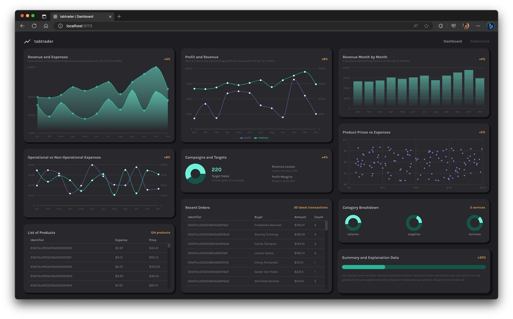

## Dashboard Trading App

> Demonstrating React Charts (https://recharts.org/)



Featuring:

- Vite (French word for "quick", pronounced "veet") `npm create vite@latest`

Regards, <br />
Luigi Lupini <br />
<br />
I ❤️ all things (🇮🇹 / 🛵 / ☕️ / 👨‍👩‍👧)<br />

## Getting Started

First, run the development server:

```bash
npm run dev
# or
yarn dev
```
